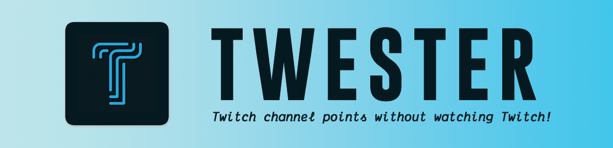
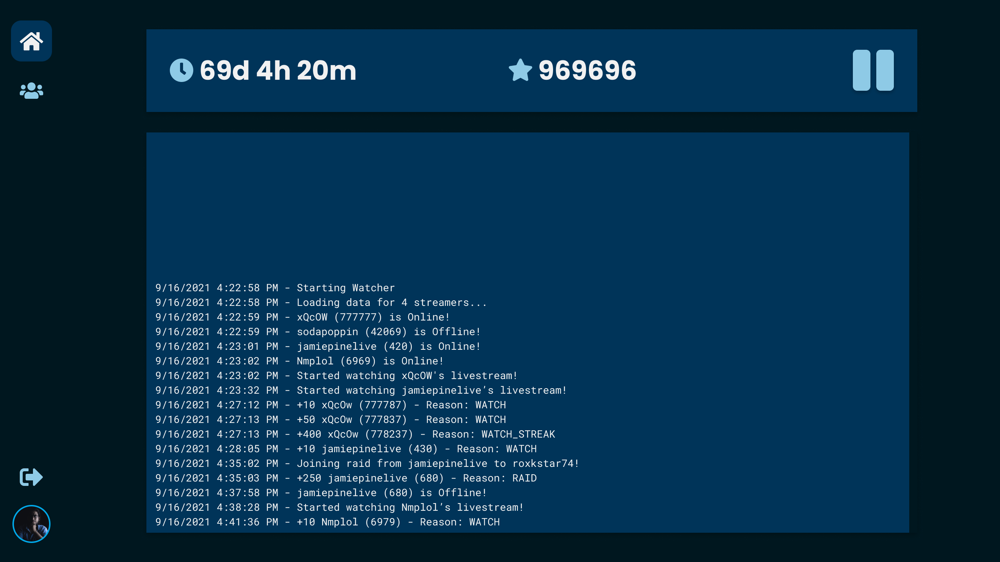
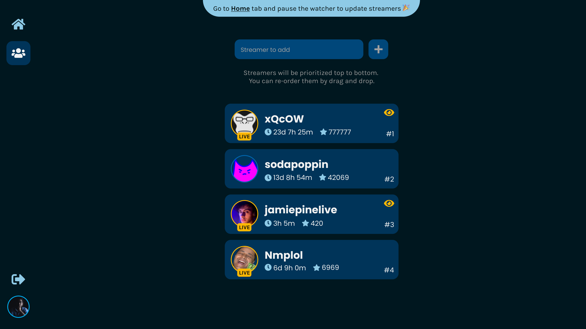

  <h1>Twester</h1>
  
<strong>Twitch channel points without watching Twitch!</strong>

  <h3 align="center">
    <a href="#download">Download</a>
     | 
    <a href="#features">Features</a>
     | 
    <a href="#screenshots">Screenshots</a>
     | 
    <a href="#how-it-works">How it works?</a>
     | 
    <a href="#credits">Credits</a>
  </h3>

## Download

Latest releases are available at [https://twester.co](https://twester.co). You can also download from [GitHub Releases](https://github.com/twesterapp/twester/releases) as well.

## What is this app all about?

Twester is a free and open source desktop app that will watch Twitch livestreams for the list of streamers you provide and harvest channel points.

> We all love to use channel points in our favorite Twitch streamer's chat, especially doing some _gamba_ in the hope of more channel points. Sometimes, the _gamba_ screws you and you go broke and start from 0. Well, no more! Now you can earn channel points without having to watch Twitch's livestream.

## Demo

> Twester is running and harvesting channel points.

**Add GIF here and on twester.co**

## Features

-   **Minimal and Intuitive UI**. Start and pause Twester will a click of a button.
-   Add **unlimited streamers** to streamer's list and Twester will watch them\* and harvest channel points for you.
-   **Streamers** tab to manage streamer's list and check their stats (time watched, points harvested, is online/offline, twester watching).
-   **Event logs** about all the things you need to know. Example, when a streamer goes offline or online, when channel points are earned, when Twester starts or stops watching a livestream and more.

> \* Twitch allows max 2 livestreams to be watched at a time. Twester will pick the highest priority streamers to be watched.

## Features to come in future

-   **Predictions** - Twester will make predictions based on your preferences.
-   **Analytics** - Visual representation of channel points earned for a streamer.

## Screenshots

> **Home** tab - Twester is _watching_

 
 

> **Streamers** tab - Twester is _watching_ **xQcOW** and **jamiepinelive**

 

## How it works?

-   Twitch rewards channel points for a lot of [reasons](https://help.twitch.tv/s/article/channel-points-guide?language=en_US#viewers). Twester earns channel points by mainly “watching” a streamer.
-   Twester earns channel points for the following
    -   Watching
    -   Active watching (bonus redeemed by click)
    -   Watch streaks
    -   Participating in a Raid
-   Twitch allows users to watch and get channel points for maximum of 2 streamers at a time. That’s why Twester asks you to keep the streamers on Streamers tab sorted(top to bottom) based on priority. Twester picks the 2 streamers from the list with highest priority that are online and “watches” their livestream.
-   To “watch” a livestream, Twester sends a “minute watched event” request to Twitch’s API for that livestream. Twitch uses that request to know which user has watched a livestream for a minute. After several of these requests, Twitch rewards the user with channel points.

## Credits

Thanks to [Alessandro Maggio](https://github.com/Tkd-Alex) for [Twitch-Channel-Points-Miner-v2](https://github.com/Tkd-Alex/Twitch-Channel-Points-Miner-v2) and to [Leo Leontev](https://github.com/Tkd-Alex) for [Twitch-Channel-Points-Miner](https://github.com/gottagofaster236/Twitch-Channel-Points-Miner) for providing technology behind Twester's core functionality.

Thanks to <a href="https://www.vecteezy.com/free-vector/web">Web Vectors by Vecteezy</a> for the logo.

---

##### Created & Designed by [@ceoshikhar](https://ceoshikhar.com/) with love in India
